# Hi there 👋, I'm Minh
🚀 As an Agentic Engineer at We The Flywheel, I design and build AI-powered systems that leverage Large Language Models (LLMs), autonomous agents, and workflow orchestration to automate complex business processes. My work focuses on developing agent architectures, integrating tools and external services, implementing Retrieval-Augmented Generation (RAG) pipelines, and creating scalable AI solutions that enhance productivity and decision-making across products and operations.

I am also a Fullstack Developer with a strong backend focus. My technical interests include Node.js, TypeScript, microservices, event-driven architecture, distributed systems, and cloud-native development. I enjoy building systems that combine robust software engineering principles with the latest advances in AI.

  

- 💬 Ask me about **everything you need**

- 📫 How to reach me **elevenine00@gmail.com**

## Skill stack

**Also comfortable with**: SQL (BigQuery, Postgres, Mongo, etc), CI/CD pipelines, Networking and Security (VPC, IAM), Vector Databases, Cloud Infrastructure (AWS/GCP), Data Pipelines, Monitoring & Observability, Prompt Engineering, MLOps workflows.

---

## Projects - showcase

**`I’m still polishing this section ✨ but u can always take a peek at my repo — that’s where the fun stuff lives.`**

---
## Stats

  
  

---
<h3 align="left">More contact?</h3>
<a href="https://www.linkedin.com/in/cyndie-lauper/" target="_blank" rel="noopener noreferrer">Click here</a>
